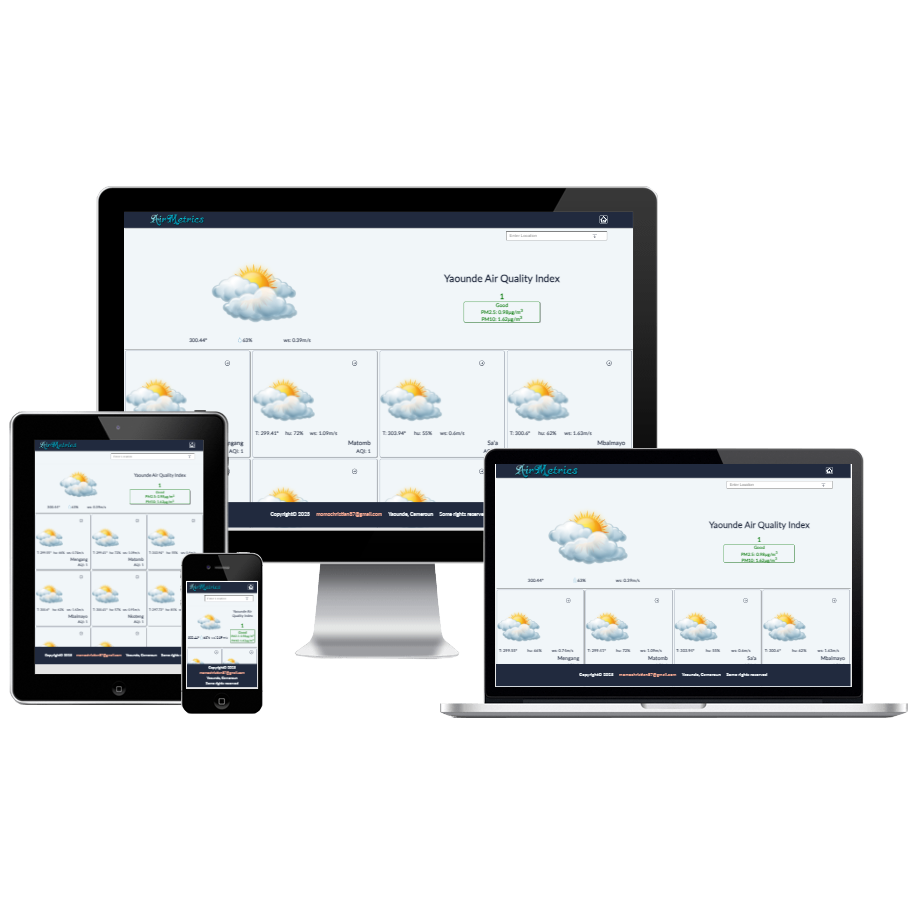

<a name="readme-top"></a>
<div align="center">
  
  
  <br/>  
  <h2><b>Air Metrics Web App</b></h2>
</div>
<div align="center">
  
</div>

# 📗 Table of Contents

- [📖 About the Project](#about-project)
  - [🛠 Built With](#built-with)
    - [Tech Stack](#tech-stack)
    - [Key Features](#key-features)
  - [🚀 Live Demo](#live-demo)
- [💻 Getting Started](#getting-started)
  - [Setup](#setup)
  - [Prerequisites](#prerequisites)
  - [Install](#install)
  - [Usage](#usage)
  - [Run tests](#run-tests)
  - [Deployment](#triangular_flag_on_post-deployment)
- [👥 Authors](#authors)
- [🔭 Future Features](#future-features)
- [🤝 Contributing](#contributing)
- [⭐️ Show your support](#support)
- [🙏 Acknowledgements](#acknowledgements)
<!-- - [❓ FAQ (OPTIONAL)](#faq) -->
- [📝 License](#license)

<br>

# 📖 Air Metrics Web APP <a name="API-based webapp"></a>
>Air Metrics is a React Redux web application that displays air quality data. The data are provided by external API and the user can display air quality and weather data from different areas around the world by using a search engine.
<br>

## 🛠 Built With <a name="built-with"></a>
- React
- Redux
- SASS
- Jest for testing
- Linters

### Tech Stack <a name="tech-stack"></a>
<details>
  <summary>Client</summary>
  <ul>
    <li><a href="https://create-react-app.dev/docs/getting-started/">React</a></li>
    <li><a href="https://redux.js.org/">Redux</a></li>
    <li><a href="https://sass-lang.com/">SASS</a></li>
    <li><a href="https://jestjs.io/docs/getting-started">Jest</a></li>
    <!-- <li><a href="https://jestjs.io/docs/getting-started">Jest</a></li> -->
  </ul>
</details>
<details>
  <summary>API</summary>
  <ul>
    <li><a href="https://ipgeolocation.io/">IP Geolocalistion</a></li>
    <li><a href="https://openweathermap.org/weather-conditions">Weather Data</a></li>
    <li><a href="https://openweathermap.org/api/air-pollution">Pollution Data</a></li>
  </ul>
</details>
<br>

### Key Features <a name="key-features"></a>
- A home page showing User city data and closest cities data
- Details page showing details informations about a given location
- Search engine.
<p align="right">(<a href="#readme-top">back to top</a>)</p>

## 🚀 Live Demo <a name="live-demo"></a>
>[Live Demo](https://airmetrics.onrender.com)

> [Video Presentation](https://www.loom.com/share/2ad53b4776e94f43bb9c464cf7a63c5e?sid=014845e4-9b2d-4449-9e89-59e30a0f64d4)
<p align="right">(<a href="#readme-top">back to top</a>)</p>


## 💻 Getting Started <a name="getting-started"></a>
>To get a local copy up and running, follow these steps.

### Prerequisites
1. Web browser.
2. Code Editor.
3. Git-smc.

### Setup
> To clone this repository to your desired folder, run this command:
```sh
  cd my-folder
  git clone https://github.com/momo-87/air-metrics-webapp.git
```

### Install
> Run this command:
```sh
  cd my-project
  npm install
```

### Usage
> npm start
### Run tests
> npm test
### Deployment
> npm run build
<p align="right">(<a href="#readme-top">back to top</a>)</p>


## 👥 Author <a name="authors"></a>
👤 Christian Romuald MOMO TONFACK
- GitHub: [@githubhandle](https://github.com/Momo-87)
- Twitter: [@twitterhandle](https://twitter.com/Momo_yde)
- LinkedIn: [LinkedIn](https://www.linkedin.com/in/christian-momo/)
<p align="right">(<a href="#readme-top">back to top</a>)</p>


## 🔭 Future Features <a name="future-features"></a>
- [ ] Display Forecast data
- [ ] Display Historical data
<p align="right">(<a href="#readme-top">back to top</a>)</p>

## 🤝 Contributing <a name="contributing"></a>
> Contributions, issues, and feature requests are welcome!
Feel free to check the [issues page](https://github.com/momo-87/air-metrics-webapp/issues).
<p align="right">(<a href="#readme-top">back to top</a>)</p>


## ⭐️ Show your support <a name="support"></a>
>If you like this project just give it a star ⭐️.
<p align="right">(<a href="#readme-top">back to top</a>)</p>

## 🙏 Acknowledgments <a name="acknowledgements"></a>
>I would like to thank Microverse comnunity for their supports.
<p>I would like to thank <a href = "https://www.behance.net/sakwadesignstudio">Nelson Sakwa on Behance.</a> the author of the original design.</p>
<p align="right">(<a href="#readme-top">back to top</a>)</p>

## 📝 License <a name="license"></a>
>This project is [MIT](./LICENSE) licensed.
<p align="right">(<a href="#readme-top">back to top</a>)</p>
